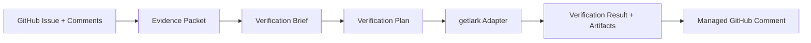

# LarkGuard: Evidence-First Bug Verification

<p align="left">
  <a href="https://www.python.org/"></a>
  <a href="https://fastapi.tiangolo.com/"></a>
  <a href="https://docs.getlark.ai/cli"></a>
  <a href="https://docs.getlark.ai/mcp-quickstart"></a>
  <a href="https://www.truefoundry.com/docs/ai-gateway/chat-completions-overview"></a>
  
</p>

Turn messy GitHub bug reports into proof — reproduced, not reproduced, or blocked — with evidence and graceful fallback when agent infrastructure fails.

**Sponsor integration:** [getlark.ai](https://getlark.ai) — **live REST + optional CLI today**; MCP/CLI scaffolds for workflow planning. [TrueFoundry AI Gateway](https://www.truefoundry.com) — optional structured parser with deterministic fallback.

<p align="left">
  <a href="https://getlark.ai"></a>
  <span style="padding: 0 10px; font-weight: 600;">•</span>
  <a href="https://www.truefoundry.com"></a>
</p>

## At a glance

- **Problem:** bug reports are noisy; repro effort is expensive and inconsistent.
- **Solution:** evidence-first pipeline from issue text to replayable verification outcome.
- **Live proof:** deterministic workflow selection + invoke evidence (`wflw_exec_*`) + issue-driven run artifacts.
- **Resilience:** explicit health modes (`healthy`, `degraded-parser`, `degraded-adapter`, `degraded-both`).



## Why this matters

Bug reports are noisy. Maintainers waste time guessing whether an issue is actionable. LarkGuard starts with evidence: fetch the issue, normalize it into a proof-oriented packet, and leave a replayable trail for verification agents to build on.

## Current MVP scope

**Step 1**
- Manual verification trigger (API + CLI)
- GitHub issue + comments fetch via REST API
- Normalized evidence packet for downstream parsing
- Local JSON run storage for replay/debug

**Step 2**
- Deterministic parser (default) → structured `verification_brief`
- Optional **TrueFoundry AI Gateway** parser (`PARSER_MODE=truefoundry_gateway`) with deterministic fallback
- Rule-based classification, confidence, and verification mode

**Step 3**
- Execution planning → `verification_plan` from the brief
- Fake Lark adapter → `verification_result` (plan → execute → result)
- End-to-end verify output: evidence → brief → plan → result

**Step 4**
- Config-driven adapter selection (`fake`, getlark scaffolds, `getlark_cli_live`, `getlark_live_check`)
- Graceful fallback to fake when `GETLARK_API_KEY` is missing

**Step 4b (getlark.ai alignment)**
- `GetLarkScaffoldAdapter` for MCP and CLI transports
- Workflow descriptions built from GitHub issue + verification plan
- Points at `api.getlark.ai` (sponsor), not Feishu Open Platform

**Step 5**
- GitHub issue comment posting with markdown summary (`ENABLE_GITHUB_COMMENTS`)
- Env-driven fault injection (`FAULT_INJECTION_MODE`, `PRIMARY_ADAPTER_MODE`)
- Visible degraded vs healthy runs in comments and resilience notes

**Step 6**
- Idempotent managed GitHub comment (create vs update)
- `demo-issue-text` CLI helper for seed issues
- Compact verify CLI summary (`Health=…`, workflow/invoke fields, issue-driven run); `--json` for full payload
- `demo-summary` for judge-friendly replay of a stored run

**Not yet:** Per-issue dynamic getlark workflow creation, target-app bug reproduction end-to-end, auth, database, or webhooks. (Optional workflow **invoke** and `wflw_exec_*` capture are implemented.)

## Parser (Step 2)

After fetching an issue, LarkGuard runs a **deterministic parser** (default) over the evidence packet and returns a `verification_brief` with:

- Summary and classification (`reproducible_candidate`, `blocked_missing_info`, `unclear`)
- Extracted reproduction steps, expected/actual behavior
- Missing-information checklist and signal flags
- Rule-based confidence and recommended mode (`manual_review` vs `lark_workflow_candidate`)

**Why deterministic first?** It is fast, reproducible, and demo-friendly — the same issue always yields the same brief. That makes debugging and judging easier before we add LLM variability.

### Optional TrueFoundry gateway parser

Set `PARSER_MODE=truefoundry_gateway` to send **one** OpenAI-compatible `POST /chat/completions` request through your [TrueFoundry AI Gateway](https://www.truefoundry.com/docs/ai-gateway/chat-completions-overview). The gateway returns JSON that is validated and mapped into `verification_brief`. **Only the parser layer** uses TrueFoundry; adapters and execution are unchanged.

**Required env:**

```env
PARSER_MODE=truefoundry_gateway
TRUEFOUNDRY_API_KEY=your_pat_or_vat
TRUEFOUNDRY_GATEWAY_BASE_URL=https://gateway.truefoundry.ai
TRUEFOUNDRY_MODEL=provider_account/model_name
```

**Optional:**

```env
TRUEFOUNDRY_STRICT_MODE=false
TRUEFOUNDRY_TIMEOUT_SECONDS=20
```

| Outcome | What you see |
|---------|----------------|
| **Gateway success** | `parser_used: truefoundry_gateway`, `parser_fallback_triggered: false`, `verification_brief.parser_source: truefoundry_gateway`, execution note “produced via TrueFoundry AI Gateway” |
| **Fallback** (default) | `parser_used: deterministic`, `parser_fallback_triggered: true`, `parser_notes` / `confidence.reason` explain the gateway error; resilience note on `verification_result` |
| **Strict failure** | `TRUEFOUNDRY_STRICT_MODE=true` → verify errors with `truefoundry_parser_failed` (no deterministic fallback) |

**Test (keep adapter on fake for a safe demo):**

```bash
PARSER_MODE=truefoundry_gateway LARK_MODE=fake FAULT_INJECTION_MODE=none \
  python -m src.cli verify --issue-number 2 --local
```

**Fallback test (missing config):**

```bash
PARSER_MODE=truefoundry_gateway TRUEFOUNDRY_API_KEY= LARK_MODE=fake \
  python -m src.cli verify --issue-number 2 --local
```

**Current limitation:** Single summarization/parsing call — not full LLM agent loops, not TrueFoundry on the execution adapter layer.

## Execution planning & fake adapter (Step 3)

After parsing, LarkGuard builds a **verification plan** (workflow name, goal, proposed steps, assumptions, blockers) and runs a **fake Lark adapter** that simulates execution without real MCP calls.

This makes the demo flow visible: **plan → execute → result**, with statuses like `blocked`, `simulated`, or `not_reproduced` and execution artifacts (notes, logs).

**Why fake execution first?** You can demo the full pipeline and stored run JSON before wiring live getlark calls. The `LarkAdapter` interface supports fake, scaffolds, live CLI list, and live REST list/invoke.

**Next:** Full MCP tool calls and `getlark workflows invoke --wait` for target-app reproduction.

## getlark.ai adapter modes

| Mode | Env | Behavior |
|------|-----|----------|
| `fake` (default) | `LARK_MODE=fake` or unset | Reliable simulated execution |
| `getlark_mcp` | `PRIMARY_ADAPTER_MODE=getlark_mcp` + `GETLARK_API_KEY` | Scaffold (`getlark_mcp_scaffold`); describes MCP workflow; **no HTTP calls** |
| `getlark_cli` | `PRIMARY_ADAPTER_MODE=getlark_cli` + `GETLARK_API_KEY` | Scaffold (`getlark_cli_scaffold`); shows intended CLI commands; **no subprocess** |
| `getlark_cli_live` | `PRIMARY_ADAPTER_MODE=getlark_cli_live` + `GETLARK_API_KEY` | **Real CLI** — runs `getlark workflows list`, captures stdout as evidence |
| `getlark_live_check` | `PRIMARY_ADAPTER_MODE=getlark_live_check` + `GETLARK_API_KEY` | **Real HTTP** `GET /workflows`; optional `POST /workflows/{id}/invoke` when enabled |
| Missing API key | mode set, no `GETLARK_API_KEY` | **Falls back to fake** with a note in `verification_result` |

`LARK_MODE` and `PRIMARY_ADAPTER_MODE` accept the same values; when both are set, **`PRIMARY_ADAPTER_MODE` wins**. Alias: `openapi_mcp` → `getlark_mcp`.

### Thin real getlark mode (`getlark_live_check`)

The thinnest honest integration: one real REST call to list workflows (`GET {GETLARK_API_URL}/workflows?limit=5` with `X-API-Key`). This proves credentials and reachability — **not** full live test execution for the GitHub issue.

**Required env:**

```env
GETLARK_API_KEY=your_key_from_dashboard
GETLARK_API_URL=https://api.getlark.ai
LARK_MODE=getlark_live_check
# or override per run:
PRIMARY_ADAPTER_MODE=getlark_live_check
```

**Optional:**

```env
GETLARK_STRICT_MODE=false    # true = fail verify on live API error (no fake fallback)
GETLARK_TIMEOUT_SECONDS=15
GETLARK_ENABLE_WORKFLOW_INVOKE=false  # true = attempt one real workflow invoke after list
GETLARK_WORKFLOW_ID=wflw_your_smoke_workflow_id  # preferred: deterministic invoke target
# GETLARK_WORKFLOW_NAME=larkguard-smoke          # used when WORKFLOW_ID is unset
GETLARK_ENABLE_CLI_LIVE=false        # true = also run `getlark workflows list` on live_check runs
GETLARK_CLI_BIN=getlark              # path to @getlark/cli binary
```

**What counts as a “real call”:** A successful `GET /workflows` with HTTP 2xx and JSON parsed into `verification_result.evidence` (`live_api`, `workflows`, `api_response`, plus `workflow_selected`, `invoke_status`, `issue_workflow_run`). If `GETLARK_ENABLE_WORKFLOW_INVOKE=true`, LarkGuard also attempts `POST /workflows/{workflow_id}/invoke` and stores invoke evidence (`invoke_attempt`, `invoke_response`, `execution_id`).

**On live failure** (`GETLARK_STRICT_MODE=false`, default): verify still completes via **fake adapter**; `fallback_triggered=true`, `adapter_used=fake`, and notes explain the API/CLI error. With `GETLARK_STRICT_MODE=true`, verify returns HTTP 502 with `{adapter_id}_failed` (e.g. `getlark_cli_live_failed`).

**Test command:**

```bash
FAULT_INJECTION_MODE=none PRIMARY_ADAPTER_MODE=getlark_live_check \
  python -m src.cli verify --issue-number 2 --local
```

**Success output (CLI):** compact summary with `Health=healthy`, `adapter: getlark_live_check`, optional `Execution proof: wflw_exec_…`. Add `--json` for full payload.

**Fallback output:** `adapter_used: fake`, `fallback_triggered: true`, `Health=degraded-adapter`.

**If invoke fails:** same command with `GETLARK_ENABLE_WORKFLOW_INVOKE=false` — still completes with live list + `status: simulated`.

**`.env` for getlark scaffold:**

```env
GETLARK_API_KEY=your_key_from_dashboard
GETLARK_API_URL=https://api.getlark.ai
LARK_MODE=getlark_mcp
```

Get your API key: [getlark.ai](https://getlark.ai) → Settings → API Keys. Docs: [MCP](https://docs.getlark.ai/mcp-quickstart), [CLI](https://docs.getlark.ai/cli).

**Why fallback is intentional:** Demos should not fail without credentials. `execution_notes` always shows which adapter ran.

### Why this still fits Lark (CLI/MCP sponsor track)

LarkGuard is built around **getlark workflows as the execution surface**:

- **Planning layer** — verification plans and workflow descriptions are shaped for MCP/CLI create + invoke (scaffold adapters show the intended `@getlark/cli` commands).
- **Live REST today** — `getlark_live_check` proves credentials, lists workflows, and optionally invokes one (`execution_id` captured).
- **Live CLI today** — `getlark_cli_live` runs real `getlark workflows list` and stores stdout as evidence; set `GETLARK_ENABLE_CLI_LIVE=true` on REST runs for combined proof.
- **Next step** — wire full MCP tool calls and `getlark workflows invoke --wait` for target-app reproduction.

**Lark CLI-only demo:**

```bash
PRIMARY_ADAPTER_MODE=getlark_cli_live FAULT_INJECTION_MODE=none \
  python -m src.cli verify --issue-number 2 --local
```

## GitHub comments & fault injection (Step 5)

Post a markdown verification summary back to the GitHub issue (requires token scope **`issues: write`** or repo write access).

```env
ENABLE_GITHUB_COMMENTS=true
COMMENT_ONLY_ON_COMPLETED=true

PRIMARY_ADAPTER_MODE=fake          # or getlark_mcp / getlark_cli / getlark_cli_live / getlark_live_check
FAULT_INJECTION_MODE=none          # none | force_adapter_failure | force_fallback_note
```

| Demo | `PRIMARY_ADAPTER_MODE` | `FAULT_INJECTION_MODE` | What you see |
|------|------------------------|------------------------|--------------|
| **Healthy** | `fake` or `getlark_mcp` | `none` | Normal summary; fake or scaffold adapter |
| **Degraded** | `getlark_mcp` | `force_adapter_failure` | Comment banner: primary failed → fake fallback |
| **Resilience note** | any | `force_fallback_note` | Extra resilience bullet; normal execution |

`LARK_MODE` still works if `PRIMARY_ADAPTER_MODE` is unset. **Fake remains the reliable fallback** — runs always complete unless GitHub fetch fails.

LarkGuard skips its own posted comments when building evidence, so re-verifying an issue does not treat prior bot posts as reproduction steps.

## Demo setup (Step 6)

**One managed comment per issue** — marker `<!-- larkguard:managed -->`. Re-runs **update** the same GitHub comment (`comment_action: updated`) instead of spamming new ones.

### Seed issue examples

```bash
python -m src.cli demo-issue-text --type vague
python -m src.cli demo-issue-text --type structured
python -m src.cli demo-issue-text --type degraded
```

Copy title/body into a new GitHub issue (or edit an existing test issue). CLI hints mention `Simulated` for fake/scaffold runs; with `getlark_live_check` + successful invoke, structured issues can show **`reproduced`**.

### Healthy run (with comments)

```bash
ENABLE_GITHUB_COMMENTS=true \
PRIMARY_ADAPTER_MODE=fake \
FAULT_INJECTION_MODE=none \
python -m src.cli verify --issue-number <N> --local
```

### Degraded run (with comments)

```bash
ENABLE_GITHUB_COMMENTS=true \
PRIMARY_ADAPTER_MODE=getlark_mcp \
FAULT_INJECTION_MODE=force_adapter_failure \
python -m src.cli verify --issue-number <N> --local
```

Re-run the same issue to see `GitHub comment: updated` in the CLI.

### What judges should notice

1. **Evidence-first pipeline** — issue → brief → plan → result (stored + replayable).
2. **getlark-ready** — live REST list/invoke + optional CLI list; scaffolds show intended MCP/CLI workflow shape.
3. **Resilience** — degraded run completes via fake fallback; comment banner makes it obvious.
4. **Idempotent feedback** — one living verification comment on the issue, updated each run.
5. **Safe defaults** — fake adapter + optional comments; no live getlark calls required for demo.

## Sponsor demo (canonical)

Full-stack path for judges: TrueFoundry gateway parser + live getlark list/invoke + real execution ID.

**Prerequisites:** `GETLARK_API_KEY` in `.env`, a workflow on your getlark account (copy its `wflw_*` id into `GETLARK_WORKFLOW_ID`), and TrueFoundry gateway env vars if using the gateway parser.

```bash
PRIMARY_ADAPTER_MODE=getlark_live_check \
GETLARK_ENABLE_WORKFLOW_INVOKE=true \
GETLARK_ENABLE_CLI_LIVE=true \
GETLARK_WORKFLOW_ID=wflw_PThpADVZrGzDczLF4I24c9uZ \
PARSER_MODE=truefoundry_gateway \
FAULT_INJECTION_MODE=none \
python -m src.cli verify --issue-number <N> --local
```

Use a structured reproduction issue in your repo (e.g. issue **#3** if you seeded `demo-issue-text --type structured`). Replace `GETLARK_WORKFLOW_ID` with your smoke workflow id from `getlark workflows list`.

**Judge-friendly replay** (after a run completes):

```bash
python -m src.cli demo-summary --run-id <run_id> --local
```

**Expected CLI output (abbreviated):**

```
Verification complete — run_id=abc123def456
Health=healthy · Lark=getlark_live_check · Parser=truefoundry_gateway
Result: reproduced · workflow `github_issue_verification` · adapter `getlark_live_check`
Execution proof: `wflw_exec_…`
Workflow selected: `wflw_PThpADVZrGzDczLF4I24c9uZ`
Selection source: env_id
Invoke status: success
Issue-driven run: issue #2 -> workflow wflw_… (selection=env_id, invoke=success, execution_id=wflw_exec_…)
```

**Expected managed GitHub comment (key lines):**

```
> **Live sponsor run** — getlark execution proof captured.
- **Status:** Reproduced (live getlark workflow execution proof — not target-app reproduction)
- **Execution proof:** `wflw_exec_… (workflow wflw_…)`
- **Workflow selected:** `wflw_…`
- **Selection source:** `env_id`
- **Invoke status:** `success`
- **Issue-driven run:** `issue #<N> -> workflow wflw_… (selection=env_id, invoke=success, execution_id=wflw_exec_…)`

The managed comment explicitly states that **Reproduced** means live getlark workflow execution proof — not target-app bug reproduction.

Without `GETLARK_ENABLE_WORKFLOW_INVOKE=true`, the same command completes with `status: simulated` (list-only live check).

### Resilience demos (TrueFoundry + adapter fallbacks)

| Health | Meaning | Demo command |
|--------|---------|--------------|
| `healthy` | No parser or adapter fallback | Canonical sponsor command above |
| `degraded-parser` | TrueFoundry gateway failed → deterministic parser | `PARSER_MODE=truefoundry_gateway` with `TRUEFOUNDRY_API_KEY` unset |
| `degraded-adapter` | Live getlark adapter failed → fake executor | `PRIMARY_ADAPTER_MODE=getlark_live_check` + invalid `GETLARK_API_KEY` |
| `degraded-both` | Parser and adapter both fell back | `PARSER_MODE=truefoundry_gateway` + invalid keys + `FAULT_INJECTION_MODE=none` |

**Degraded-both demo** (screenshot target — both fallbacks visible in CLI + comment):

```bash
PARSER_MODE=truefoundry_gateway TRUEFOUNDRY_API_KEY= \
PRIMARY_ADAPTER_MODE=getlark_live_check GETLARK_API_KEY=invalid \
FAULT_INJECTION_MODE=none \
python -m src.cli verify --issue-number 2 --local
```

Expect: `Health=degraded-both`, parser fallback line, adapter fallback line, comment banner mentioning both fallbacks.

### Demo assets (screenshots / video)

Capture these for Devpost:

1. **CLI** — `demo-summary` showing `Health=healthy`, `Execution proof`, timings.
2. **GitHub comment** — managed comment with **Live sponsor run** banner and honest Reproduced qualifier.
3. **Degraded run** — `degraded-both` or `force_adapter_failure` showing fallback banner.
4. **Run store** — `.larkguard_runs/` + `python -m src.cli replay --run-id … --local`.

Do not screenshot private repo issues or tokens. Never commit `.env` or run JSON with secrets.

## Quickstart

```bash
# 1. Create and activate a virtual environment
python3.11 -m venv .venv
source .venv/bin/activate

# 2. Install dependencies
pip install -r requirements.txt

# 3. Run tests (use project venv so deps are always found)
.venv/bin/pytest -q tests/test_larkguard_core.py

# 4. Configure environment
cp .env.example .env
# Edit .env and set GITHUB_TOKEN (required) and optional GITHUB_OWNER / GITHUB_REPO

# 5. Start the API
uvicorn src.main:app --reload

# 6. In another terminal, verify an issue (uses env defaults if owner/repo omitted)
python -m src.cli verify --issue-number 1 --local
# Add --json only when you need the full VerifyResponse payload

# Or call the API directly
curl -X POST http://127.0.0.1:8000/verify \
  -H "Content-Type: application/json" \
  -d '{"issue_number": 1, "owner": "your-org", "repo": "your-repo"}'

# 7. Inspect stored runs
python -m src.cli runs --local
ls .larkguard_runs/
```

### CLI commands

```bash
python -m src.cli demo-issue-text --type structured
python -m src.cli verify --issue-number 123 --owner org --repo repo --local
python -m src.cli replay --run-id <run_id> --local
python -m src.cli demo-summary --run-id <run_id> --local
python -m src.cli runs --local
```

Omit `--local` to call the running API instead (default `http://127.0.0.1:8000`).

## API routes

| Method | Path | Description |
|--------|------|-------------|
| GET | `/health` | Health check |
| POST | `/verify` | Full pipeline: fetch issue → brief → plan → result (optional GitHub comment) |
| POST | `/replay` | Load stored run by `run_id`, or re-run verification |
| GET | `/runs` | List recent run summaries |

### TrueFoundry resilience demo pair

**Gateway success** — `PARSER_MODE=truefoundry_gateway` with valid credentials → `Health=healthy`, parser `truefoundry_gateway`.

**Gateway fallback** — unset `TRUEFOUNDRY_API_KEY` (strict off) → `Health=degraded-parser`, parser falls back to `deterministic`, resilience notes explain why.

TrueFoundry powers structured interpretation; deterministic fallback keeps the workflow alive.

## Planned next steps

- **Full getlark MCP + invoke --wait** — per-issue workflow create/invoke for target-app reproduction
- **Hosted deployment** — Docker/one-click run for judges without local setup
- **Webhook trigger** — auto-verify on new/updated issues

## Project layout

```
src/
  main.py                 # FastAPI routes
  service.py              # Orchestration
  parser.py               # Deterministic + optional TrueFoundry gateway parser
  lark_adapter.py         # Plan + fake/getlark execution adapters
  github_comment_poster.py  # Markdown comment render + post
  github_client.py        # GitHub REST client
  run_store.py            # Local JSON persistence
  run_health.py           # Health=healthy/degraded-* summary helpers
  evidence_utils.py       # Evidence artifact lookup helpers
  models.py               # Pydantic schemas
  config.py               # Environment config
  cli.py                  # Rich CLI
assets/logos/             # Sponsor logos (README)
tests/                    # Pytest smoke tests
```

## License

See [LICENSE](LICENSE).
